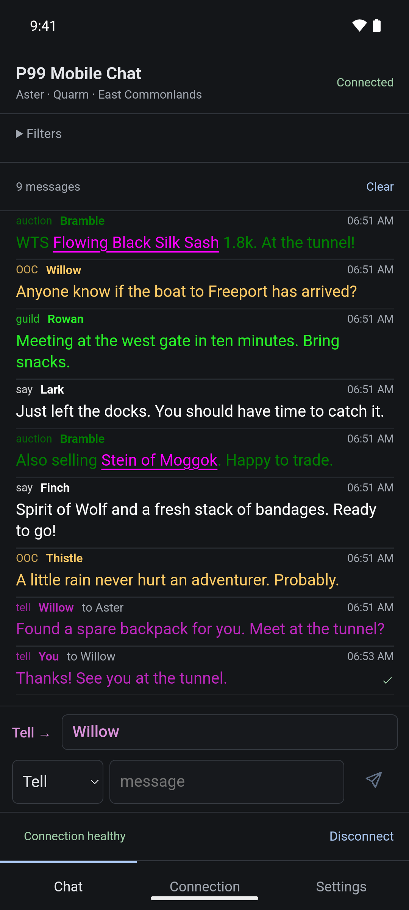

# P99 Mobile Chat

Chat on Project 1999 or Project Quarm from your Android phone. Connect as your
own character, read chat, reply to tells, and look up items without running the
graphical game client.

**[Download the Android APK](https://github.com/rm-you/p99-mobile-client/releases/latest)**
· [Installation and updates](INSTALLING.md)
· [User guide](docs/USER_GUIDE.md)
· [What's new](CHANGELOG.md)

<p align="center">
  
</p>

<p align="center"><em>The Android v1.1.0 release APK, displaying fictional chat from a local test server.</em></p>

## Get connected

1. Log out of the graphical game client.
2. Open **Connection**, choose **P99 Green**, **P99 Blue**, or **Quarm**, and enter
   your account, password, and existing character's name.
3. Tap **Login**. Your character joins the zone where you left them. Choose
   **Save** when prompted if you'd like to reconnect later using device authentication.

P99 uses your **EQEmulator login-server account**; Quarm uses your
**TAKP login-server account**.

## Using chat

- **Read and filter:** expand **Filters** to search messages or choose channels.
- **Send:** choose a channel, type a message, and tap the paper-plane icon.
- **Reply:** swipe another player's message in either direction to send them a tell.
- **Inspect items:** tap an item link for offline details. Quarm shows P99 reference
  stats, which may differ.
- **Preferences:** use **Settings** for text size, chat history (on by default), and optional alerts.

The app tries to stay connected in the background, but Android's battery settings
can interrupt it. Use **Disconnect** or **Stop** in the connection notification
when you're done.

See the [user guide](docs/USER_GUIDE.md) for saved characters, history and exports,
notifications, and troubleshooting. [Privacy](PRIVACY.md) explains what stays on
your device.

## Development

The native app uses Tauri 2, React, and the
[reusable Rust P99 client](https://github.com/rm-you/p99-logger-client). It connects
directly to the game servers. Android is the distributed release; the repository
also includes iOS source, which requires separate platform validation. See the
[roadmap](ROADMAP.md) for remaining work.

Install Node.js 24, the Rust toolchain pinned in `rust-toolchain.toml`, and the
[Tauri prerequisites](https://v2.tauri.app/start/prerequisites/), then:

```sh
npm ci
npm run dev
```

The browser preview renders the UI with connection disabled. Use
`npm run tauri dev` for a native desktop development window with networking.

### Android

With the Android SDK, NDK, and Java configured, enable Windows Developer Mode
if building on Windows so Tauri can create its native library symbolic links.
Then run:

```sh
npm run tauri -- android init
npm run tauri -- android dev
# Build a release package:
npm run tauri -- android build
```

### iOS

For hosted Mac builds, unsigned device candidates, and TestFlight setup, see
[the iOS testing guide](docs/IOS_TESTING.md). On a Mac with Xcode configured:

```sh
npm run tauri -- ios init
python3 scripts/prepare_ios.py
python3 scripts/resolve_ios.py
npm run tauri -- ios dev
# Build a release package:
npm run tauri -- ios build
```

Production Android signing and tag-triggered GitHub distribution are described in
[RELEASING.md](RELEASING.md). Do not commit signing keys or local credential files.

## Architecture and checks

The app's gold P99 speech-bubble icon is shared across platforms. Source artwork,
the generation prompt, and regeneration instructions are in
[`src-tauri/icons/source/`](src-tauri/icons/source/README.md). Run
`npm run icons:generate` after changing the artwork. Normal Tauri development and
build commands sync the committed icons into initialized Android/iOS projects.

- `src/`: configuration screen, channel filters, bounded chat history, and typed
  events received over a Tauri IPC channel.
- `src-tauri/src/session.rs`: one cancellable network worker, configuration
  validation, and serial session shutdown.
- `src-tauri/src/outgoing.rs`: typed chat requests, input validation, and a bounded
  command queue scoped to the current connected session.
- `src/ChatComposer.tsx` and `src/SwipeToReply.tsx`: expandable composition and tell
  reply gestures, with recipient selection and failed-draft retention.
- `src-tauri/src/lib.rs`: native commands and application lifecycle callbacks.
- `src-tauri/src/background.rs` and `delivery.rs`: session lifetime and bounded
  event delivery while the webview is hidden.
- `src-tauri/session-service/`: Android foreground service, private connection
  notification, and native Stop control; Android/iOS copy and share controls.
  iOS supplies native lifecycle and local alerts; persistent service support remains Android-only.
- `src-tauri/src/settings.rs` and `experience.rs`: validated, atomic writes of nonsecret preferences.
- `src-tauri/src/history.rs`: configurable SQLite retention and native alert matching.
- `src-tauri/src/support.rs`: bounded history exports, sharing, and sanitized diagnostics.
- `src/Preferences.tsx`, `MessageActions.tsx`, and `useUnread.ts`: appearance, history, alerts, message actions, and unread state.
- `src-tauri/src/items.rs`: offline item lookup and safe Wiki browser URLs.
- `src-tauri/src/items/`: indexed SQLite lookup and formatting of classic item stats.
- `src-tauri/data/`: original SQLite snapshot, source metadata, and update instructions.
- `scripts/import_items.py`: verifies and copies the source snapshot without changing it.
- `src/itemText.ts`: converts decoded UTF-8 item ranges for inline rendering.
  Records without these ranges retain separate tappable item buttons.
- `src-tauri/secure-login/`: native Keystore/Keychain integration. Its Rust API
  exposes no credential-reading command to the webview. Android key use is bound
  to the authenticated `CryptoObject`; iOS access is enforced by Keychain ACLs.
- `p99-logger-client`: protocol handling, authentication, decoding, retries, and
  the bundled asset checksum inventory. These stay in the library repository.

The Rust manifest depends on the library's `main` branch, with its CLI feature
disabled. `Cargo.lock` records the exact resolved commit. To adopt a newer
library revision deliberately, run `cargo update -p p99-logger-client` inside
`src-tauri`, then review and commit the lockfile change. Inline links require the
logger's additive `text_start` / `text_end` fields; `start` / `end` describe the
original wire bytes and must not be used to slice decoded text. The locked library
supplies these fields; older records without them retain separate item buttons.

```sh
npm run build
npm test
npm run format:check
cd src-tauri
cargo fmt --all --check
cargo test --workspace --lib
cargo clippy --workspace --all-targets -- -D warnings
```

Rust desktop checks require the platform's Tauri system libraries even though
the unit tests do not launch a webview. Tests contain synthetic examples only.
The previous single-channel preference is migrated automatically when loaded.
The frontend and Rust checks do not establish successful mobile packaging or
an actual phone-to-game-server connection; those require device testing.
CI additionally builds an Android APK so Kotlin service and manifest changes are
compiled as well as Rust. A successful APK build still requires device validation.

Secure storage implementation references:
[Android authentication-bound keys](https://developer.android.com/identity/sign-in/biometric-auth#auth-per-use-keys)
and [Apple Keychain access control](https://developer.apple.com/documentation/localauthentication/accessing-keychain-items-with-face-id-or-touch-id).
Hosted iOS checks compile the native plugins and exercise the Simulator app.
Real Face ID/passcode and game-session behavior still require iPhone validation.

## License

The app's own code is [MIT licensed](LICENSE). Dependencies and the bundled item
snapshot retain their original terms; see [component and data notices](DEPENDENCIES.md).
